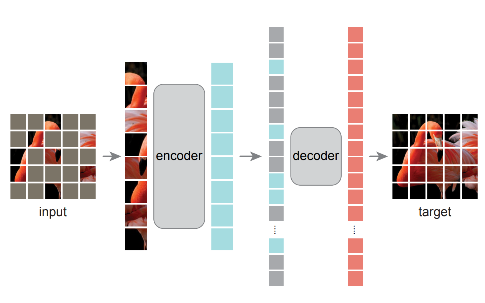

# Masked Autoencoder (MAE) Training for Strong Lensing Image Classification

## Task Description
This project involves training a **ViT based Masked Autoencoder (MAE)** on the `no_sub` samples from the provided dataset to learn a **feature representation of strong lensing images**. The MAE is trained to **reconstruct masked portions of input images**. After this pre-training phase, the model is fine-tuned on the full dataset for a **multi-class classification task**, distinguishing between three classes:

- `no_sub`: No substructure
- `cdm`: Cold dark matter substructure
- `axion`: Axion-like particle substructure

The model is implemented using **PyTorch**.

## MAE Model Architecture
The MAE paper is available at:
[MAE paper](https://arxiv.org/abs/2111.06377)




## Implementation Details
### 1. **Pre-training Phase (Masked Autoencoder Training)**
- **Objective**: Learn a feature representation by reconstructing masked parts of input images.
- **Architecture**: Standard MAE model based on transformer encoders.
- **Loss Function**: Mean Squared Error (MSE) for reconstruction.
- **Training**: Conducted on the `no_sub` samples.

### 2. **Fine-tuning Phase (Classification Task)**
- **Objective**: Classify images into one of the three categories.
- **Model**: Feature representations from the pre-trained MAE are used to fine-tune a classification model.
- Replaced the MAE DEcoder with a custom classifier:
    ```python
    model.fc = torch.nn.Sequential(
        torch.nn.Linear(model.fc.in_features, 64),
        torch.nn.BatchNorm1d(64),
        torch.nn.ReLU(),
        torch.nn.Dropout(0.4),
        torch.nn.Linear(64, 3)
    )
    ```
- Three different fine-tuning strategies :
    - Model 1: Fine-tuned only the classification head

        AUC Scores:
        - axion: `0.92`
        - cdm: `0.92`
        - no_sub: `0.99`

    - Saved model weights for this configuration

    - Model 2: Fine-tuned all LayerNorm layers

        AUC Scores:
        - axion: `0.94`
        - cdm: `0.90`
        - no_sub: `0.99`

    - Model 2: Fine-tuned the whole model

        AUC Scores:
        - axion: `0.90`
        - cdm: `0.89`
        - no_sub: `0.90`


- The first model weights were saved for future inference.

- **Loss Function**: Cross-entropy loss.
- **Evaluation Metrics**:
  - **Accuracy**
  - **ROC Curve (Receiver Operating Characteristic Curve)**
  - **AUC Score (Area Under the ROC Curve)**


## Visualization
### **Loss Curve for MAE**


### **Reconstructed Images from MAE**


### **Fine-tuning for Classification Phase Visualizations**
- **Loss and Accuracy Curve** 
- **Confusion Matrix** 
- **ROC Curve** 


## Conclusion
- **MAE pre-training** effectively learns feature representations of strong lensing images and its saved weights is `vit-mae-wt.pth`.
- **Fine-tuned classification model** achieves a high validation accuracy of **92.8%** and weight are saved as `vit-mae-classifier-wt.pth`.


